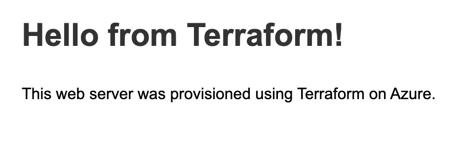
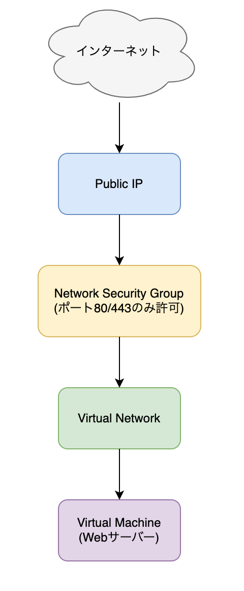

# Azure VM Webサーバー構築プロジェクト

<p align="center">
  
</p>


[](https://www.python.org/)


これは、Ruby on Railsで構築されたシンプルなTodo管理REST APIです。Azure App Service, Azure Database for MySQL, Azure Container Registryを使用してデプロイされています。


## システム構成

このプロジェクトでは、Azureを使用した基本的なWebサーバー構成を実装しています。

### 使用しているAzureリソース

#### 1. Virtual Machine - Linux/Windows Webサーバー
- Webアプリケーションをホスティングするための仮想マシン
- OSとして Linux または Windows を使用
- アプリケーションサーバーとして機能

#### 2. Virtual Network (VNet)
- ネットワーク分離のための仮想ネットワーク
- プライベートIPアドレスを使用した内部通信
- サブネット分割によるセキュリティ強化

#### 3. Network Security Group (NSG)
- ポートアクセス制御
- Web通信用に80番ポート(HTTP)と443番ポート(HTTPS)を開放
- その他の不要なポートはブロック
- トラフィックフィルタリングでセキュリティ確保

#### 4. Public IP
- 外部からのアクセスを可能にする静的パブリックIPアドレス
- DNSラベルによる名前解決対応
- Webサーバーへの外部アクセスポイント

## アーキテクチャ構成図

<p align="center">
  
</p>

## セキュリティ対策

- Network Security Groupによる不要なポートのブロック
- サブネット分離によるネットワークセグメンテーション
- SSHキーによる安全な認証方式
- 定期的なOSおよびアプリケーションの更新

## パフォーマンスと可用性

- 適切なVM規模の選択（CPU、メモリ、ディスク）
- 地理的冗長性の検討
- バックアップ戦略の実装

## コスト最適化

- 予約インスタンス利用によるコスト削減
- 使用率監視と自動スケーリングの検討
- 不要リソースの定期的確認と削除

## セットアップ手順

### 起動とデプロイ方法

1. 以下のコードを実行して、sshkeyを作成します。
```
bin/make_sshkey
```

2. 以下のコードを実行してインフラを構築します。
```
bin/terraform_apply
```

#### 停止
以下のコードを実行すると停止できます。
```
bin/terraform_destroy
```
